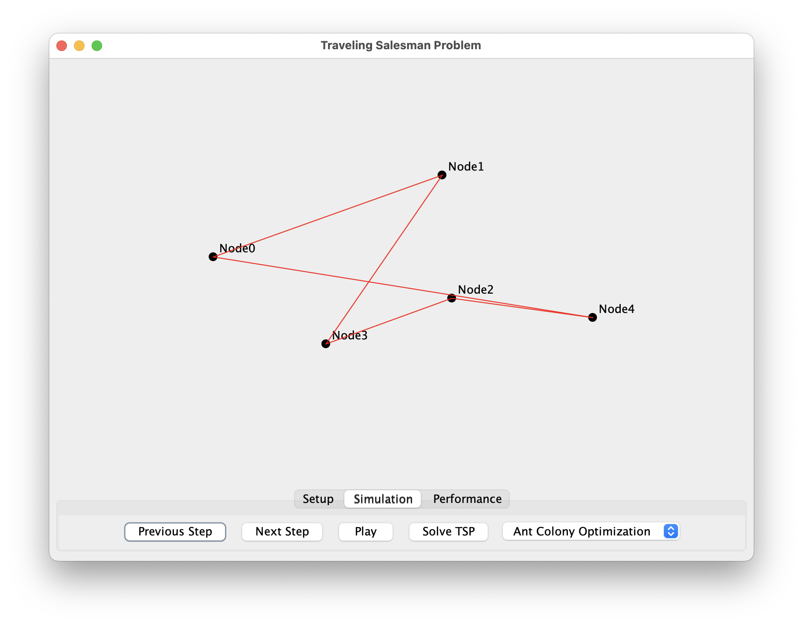

# Traveling Salesman Problem - Visualizer

A Java-based application to solve and visualize the **Traveling Salesman Problem (TSP)* using a graphical UI.
Built with Java, Swing and Maven.

## Preview

## Feature
- Generate random cities
- Visualize TSP solution using Nearest Neighbor, Brute Force or Ant Colony algorithm
- Interactive GUI
- View shortest route connecting all cities
- View performance parameter after execution of algorithm
- Step-by-step analysis
- Easily extensible for other algorithms (e.g. A-Star, Dijkstra)

## License

This project is licensed under the MIT License - see the [LICENSE](LICENSE) file for details.
